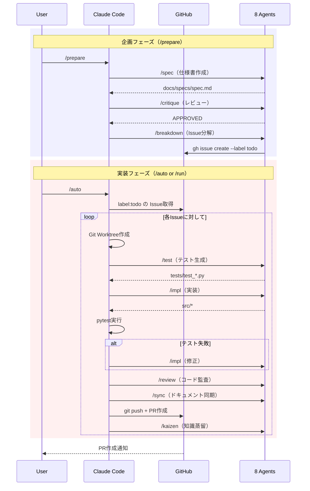

# AI Factory v2.6

**GitHub Issues駆動の完全自動開発パイプライン + 継続的改善（Kaizen）**

AI Factory は、GitHub Issue の作成から設計・実装・テスト・PR作成まで、開発プロセス全体を自動化するシステムです。8つの専門AIエージェントが協調し、Issue に記載された要件を実装可能なコードに変換します。さらに、各Issueの開発プロセスから学びを抽出し、`claude.md` に自動蓄積することで、継続的に改善していきます。

## 主要機能

- **完全自動化** - Issue検知から設計・実装・テスト・PR作成まで人手を介さず実行
- **マルチエージェント協調** - 8つの専門AI（PM, Critic, QA, Coder, Tech Lead, Librarian, Scrum Master, Issue Planner）が役割分担
- **Kaizen（改善）** - 全エージェントの作業メモを収集し、汎用的な学びを `claude.md` に自動蓄積
- **コード品質保証** - 静的解析（ruff/mypy）と変異テスト（mutmut）で品質を担保
- **TDD（テスト駆動開発）** - 実装前にテストを生成し、テストを通過する実装を作成
- **自動リトライ** - テスト失敗時は自動修正を試行（最大3回）
- **安全なGit操作** - `--force-with-lease` で他者の変更を保護
- **通知統合** - Slack/GitHub通知で進捗を可視化

## アーキテクチャ概要

```mermaid
%%{init: {'theme':'dark', 'themeVariables': { 'fontSize':'16px'}}}%%
graph LR
    subgraph "企画フェーズ /prepare"
        A["📝 /spec<br/>仕様書作成"]
        B["🔍 /critique<br/>レビュー"]
        C["📋 /breakdown<br/>Issue分解"]
    end

    subgraph "実装フェーズ /run"
        D["🌿 Worktree<br/>作成"]
        E["👷 /test<br/>テスト設計"]
        F["💻 /impl<br/>実装"]
        G{"✓ pytest"}
        K["👔 /review<br/>コード監査"]
        L{"📊 静的解析<br/>変異テスト"}
        O["📚 /sync<br/>同期"]
        P["🚀 PR作成"]
        S["📝 /kaizen<br/>改善抽出"]
    end

    W["✅ 完了"]

    A --> B --> C
    C -->|"GitHub Issues"| D
    D --> E --> F --> G
    G -->|❌ 失敗| F
    G -->|✅ 成功| K --> L
    L -->|❌ 却下| F
    L -->|✅ 承認| O --> P --> S --> W

    style A fill:#667eea,stroke:#764ba2,color:#fff,stroke-width:2px
    style C fill:#667eea,stroke:#764ba2,color:#fff,stroke-width:2px
    style E fill:#f093fb,stroke:#f5576c,color:#fff,stroke-width:2px
    style F fill:#4facfe,stroke:#00f2fe,color:#fff,stroke-width:2px
    style K fill:#43e97b,stroke:#38f9d7,color:#fff,stroke-width:2px
    style O fill:#fa709a,stroke:#fee140,color:#fff,stroke-width:2px
    style S fill:#ffecd2,stroke:#fcb69f,color:#333,stroke-width:2px
    style W fill:#a8edea,stroke:#fed6e3,color:#333,stroke-width:3px
    style G fill:#fff,stroke:#333,color:#333,stroke-width:2px
    style L fill:#fff,stroke:#333,color:#333,stroke-width:2px
```



## クイックスタート

### 前提条件

- **Python 3.12+** (推奨: `uv` による管理)
- **uv** (高速なPythonパッケージマネージャー)
- Git
- GitHub CLI (`gh`) がインストール＆認証済み
- uv パッケージマネージャー

### セットアップ

#### 1. インストール

```bash
# リポジトリのクローン
git clone <repository-url>
cd ai-drrive-dev-template

# uv のインストール (未インストールの場合)
# Windows (PowerShell):
powershell -c "irm https://astral.sh/uv/install.ps1 | iex"
# macOS/Linux:
curl -lsSf https://astral.sh/uv/install.sh | sh

# 依存関係のインストール
uv sync
```

#### 2. 設定

`.env` ファイルを作成し、必要な環境変数を設定します。

```bash
cp .env.example .env
# .env を編集して GITHUB_TOKEN 等を設定
```

#### 3. Slack通知を有効化（オプション）

```bash
export AI_FACTORY_WEBHOOK="https://hooks.slack.com/services/..."
```

### 基本的な使い方

```bash
# 1. 企画フェーズ: ヒアリング → 仕様書作成 → レビュー → Issue分解
/prepare
# ↑ 最初にヒアリング（対話）、承認後は自動実行

# 2. 実装フェーズ: 全TODO Issueを自動処理
/auto
# ↑ 確認なしで全Issue処理完了まで実行

# または、特定のIssueのみ処理
/run 42
# ↑ 確認なしでPR作成まで実行
```

**ワンコマンドで完結**:
- `/prepare` - ヒアリング後、仕様書作成からIssue分解まで自動実行
- `/auto` - 全TODO Issueを順次自動処理（確認なし、並列実行対応）
- `/run {id}` - 特定Issueのみ実装（確認なし）

## ワークフロー概要



## 設定

### config.yaml

```yaml
factory:
  label: "todo"                  # 監視するGitHub Issueラベル
  max_retries: 3                 # コマンド失敗時のリトライ回数
  enable_kaizen: true            # Kaizen機能の有効/無効

logging:
  max_bytes: 5242880             # ログファイル最大サイズ（5MB）
  backup_count: 5                # ログバックアップ数

notifications:
  post_progress: true            # GitHub Issueへのコメント投稿
  # webhook_url: 環境変数 AI_FACTORY_WEBHOOK から読み込み
```

### 環境変数

```bash
# Slack通知（オプション）
export AI_FACTORY_WEBHOOK="https://hooks.slack.com/services/T00/B00/xxx"

# GitHub認証（gh auth使用時は不要）
export GITHUB_TOKEN="ghp_xxxxxxxxxxxx"
```

## ドキュメント

詳細なドキュメントは以下を参照してください：

- **[QUICKSTART.md](docs/QUICKSTART.md)** - クイックスタート、Task Tracker実例、プロンプト例
- **[USAGE.md](docs/USAGE.md)** - 詳細な使用ガイド、トラブルシューティング
- **[AGENTS.md](docs/AGENTS.md)** - 8つのAIエージェントの詳細説明
- **[COMMANDS.md](docs/COMMANDS.md)** - 11個のコマンドの完全リファレンス
- **[WORKFLOW.md](docs/WORKFLOW.md)** - ワークフロー詳細、技術仕様
- **[REVIEW.md](docs/REVIEW.md)** - 技術レビュー、v2.4→v2.5→v2.6アップグレード履歴

## プロジェクト構成

```
.
├── .claude/
│   ├── agents/                   # AIエージェント定義（8つ）
│   │   ├── pm.md                 # Product Manager
│   │   ├── critic.md             # Critic（レビュアー）
│   │   ├── coder.md              # Coder（実装担当）
│   │   ├── qa.md                 # QA Engineer
│   │   ├── tech_lead.md          # Tech Lead（コード監査）
│   │   ├── librarian.md          # Librarian（ドキュメント管理）
│   │   ├── scrum_master.md       # Scrum Master（知識蒸留）
│   │   └── planner.md            # Issue Planner（Issue分解）
│   ├── commands/                 # コマンド定義（11個）
│   │   ├── prepare.md            # 企画フェーズ一気通貫（spec→critique→breakdown）
│   │   ├── run.md                # 実装フェーズ一気通貫（test→impl→review→sync→kaizen）
│   │   ├── auto.md               # TODO Issue自動連続処理
│   │   ├── spec.md               # 仕様書作成
│   │   ├── critique.md           # 設計レビュー
│   │   ├── breakdown.md          # 仕様書→Issue分解
│   │   ├── test.md               # テスト生成
│   │   ├── impl.md               # 実装
│   │   ├── review.md             # コード監査
│   │   ├── sync.md               # ドキュメント同期
│   │   └── kaizen.md             # 継続的改善
│   ├── factory/                  # コアシステム
│   │   ├── config.yaml           # 設定ファイル
│   │   ├── clean_all.sh          # クリーンアップスクリプト
│   │   ├── setup_aliases.sh      # エイリアス設定スクリプト
│   │   ├── memos/                # エージェント作業メモ（Kaizen用）
│   │   └── legacy/               # 旧ポーリング方式（manager.py, worker.sh）
│   ├── rules/
│   │   └── python.md             # Pythonコーディング規約
│   └── settings.local.json       # ローカル設定
├── docs/                         # ドキュメント
│   ├── AGENTS.md                 # エージェント詳細説明
│   ├── COMMANDS.md               # コマンドリファレンス
│   ├── USAGE.md                  # 使用ガイド
│   ├── WORKFLOW.md               # ワークフロー詳細
│   └── REVIEW.md                 # 技術レビュー履歴
├── .devcontainer/                # Dev Container設定
├── main.py                       # エントリーポイント（テンプレート）
├── pyproject.toml                # Pythonプロジェクト設定
├── uv.lock                       # 依存関係ロックファイル
├── .env.example                  # 環境変数テンプレート
└── setup_factory.sh              # ワンコマンドセットアップ
```

## AIエージェント一覧

| エージェント | 役割 | 使用コマンド | 作業メモ |
|------------|------|-----------|---------|
| **Product Manager** | Issue分析、仕様書作成 | `/spec` | - |
| **Critic** | 設計・コードレビュー、品質チェック | `/critique` | - |
| **Issue Planner** | 仕様書をIssueに分解 | `/breakdown` | - |
| **QA Engineer** | テストケース設計、pytest実装 | `/test` | ✓ |
| **Coder** | 機能実装、コーディング規約遵守 | `/impl` | ✓ |
| **Tech Lead** | コード監査、変異テスト実行 | `/review` | ✓ |
| **Librarian** | ドキュメント同期、アーキテクチャ更新 | `/sync` | ✓ |
| **Scrum Master** | 作業メモ収集、知識蒸留 | `/kaizen` | - |

詳細は [AGENTS.md](docs/AGENTS.md) を参照してください。

## コマンド一覧

| コマンド | 説明 | 確認 | 出力 |
|---------|------|------|------|
| `/prepare` | **企画フェーズ一気通貫** | ヒアリング時のみ対話 | 仕様書 + GitHub Issues |
| `/run {id}` | **実装フェーズ一気通貫** | なし（完全自動） | PR作成 + Issueコメント |
| `/auto` | **TODO Issue自動連続処理** | なし（完全自動） | 全Issue処理 + PR作成 |
| `/spec` | 仕様書作成 | ユーザーとの対話 | `docs/specs/spec-*.md` |
| `/critique` | 設計レビュー | `docs/specs/*.md` | レビューフィードバック |
| `/breakdown` | 仕様書→Issue分解 | `docs/specs/*.md` | GitHub Issues |
| `/test` | テストコード生成 | Issue内容 | `tests/test_*.py` |
| `/impl` | 機能実装 | Issue内容 + テスト | `src/*` |
| `/review` | コード監査・変異テスト | `src/*` | GitHub Issue コメント |
| `/sync` | ドキュメント同期 | `src/*` | アーキテクチャドキュメント |
| `/kaizen` | 継続的改善（知識蓄積） | `.claude/factory/memos/` | `claude.md` |

- **`/prepare`** - 企画フェーズ: `/spec → /critique → /breakdown` を一気通貫で実行
- **`/run {id}`** - 実装フェーズ: `/test → /impl → /review → /sync → /kaizen` を一気通貫で実行
- **`/auto`** - `label:todo` の未アサインIssueを若番順に連続処理（並列実行対応）

詳細は [COMMANDS.md](docs/COMMANDS.md) を参照してください。

## Kaizen機能（継続的改善）

AI Factoryは、各Issueの開発プロセスから学び、継続的に改善していく仕組みを持っています。

### 仕組み

1. **作業メモの記録**
   各エージェント（QA, Coder, Tech Lead, Librarian）は、作業中に遭遇したエラー、ライブラリ仕様の誤解、試行錯誤のプロセス、重要な学びを `.claude/factory/memos/issue-{id}-{agent}.md` に記録します。

2. **知識の蒸留**
   PR作成成功後、Scrum Masterエージェントが自動的に:
   - 全エージェントの作業メモを収集
   - Issue固有の内容を除外し、汎用的な学びのみを抽出
   - 影響範囲を判断し、適切なディレクトリの `claude.md` に追記

3. **知識の再利用**
   次回以降のIssue処理時、各エージェントは該当ディレクトリの `claude.md` を参照し、過去の学びを活用します。

### 作業メモの例

```markdown
# Issue #42 - Coder作業メモ

## 試行錯誤: pydantic バージョン2の仕様変更
- `Field(default_factory=list)` が動作しない
- pydantic v2 では `Field(default_factory=list)` → `list[str] = Field(default_factory=list)` に変更が必要
- 公式ドキュメント: https://docs.pydantic.dev/latest/migration/

## エラー解決: mypy型エラー
- `List[str]` → `list[str]` に変更（Python 3.9+）
```

### claude.md への蓄積例

```markdown
# Python開発の学び

## Pydantic v2 仕様変更
- `Field(default_factory=list)` の書き方が変更された
- 型アノテーションを明示的に記述する必要がある
- 参考: https://docs.pydantic.dev/latest/migration/

## 型ヒント
- Python 3.9以降は `List[str]` より `list[str]` を推奨
```

### 設定

`config.yaml` で機能の有効/無効を切り替えられます:

```yaml
factory:
  enable_kaizen: true  # false にすると Kaizen を無効化
```

## トラブルシューティング

### 認証エラー

```bash
# GitHub CLI認証を確認
gh auth status

# 再認証
gh auth login
```

### テスト失敗

```bash
# 手動でテスト実行
cd .claude/worktrees/task-<N>
uv run pytest -v
```

### Push失敗

```bash
# リモートの変更を取得
git fetch origin

# マージして再push
git merge origin/main
git push origin HEAD
```

詳細なトラブルシューティングは [USAGE.md](docs/USAGE.md) を参照してください。

## ライセンス

MIT License

## 貢献

Issue、Pull Requestは大歓迎です。

### 開発ガイドライン

- Pythonコーディング規約: [.claude/rules/python.md](.claude/rules/python.md)
- 設計レビュー必須（Criticエージェントが自動実行）
- テスト網羅率の維持

## バージョン履歴

### v2.6（2025-01-XX）
- **コマンドベースワークフローへ移行** - `/prepare`, `/run`, `/auto` で一気通貫実行
- **`/prepare` コマンド追加** - 仕様書作成 → レビュー → Issue分解を一括実行
- **`/run` コマンド追加** - 単一Issueの実装パイプライン
- **`/auto` コマンド追加** - TODO Issueの自動連続処理（並列実行対応）
- **Issue Plannerエージェント追加** - 仕様書をIssueに分解
- **Kaizen機能追加** - 全エージェントの作業メモを収集し、汎用的な学びを `claude.md` に自動蓄積
- **旧ポーリング方式を廃止** - `manager.py`, `worker.sh` を `legacy/` に移動
- 8エージェント・11コマンド構成に拡張

### v2.5（2025-01-XX）
- リトライロジック実装（`max_retries`設定の活用）
- `--force` → `--force-with-lease` で安全性向上
- Tech Leadエージェント追加（コード監査・変異テスト）
- 全コマンド詳細化（7コマンド）
- Pythonコーディング規約追加

### v2.4
- 手動Issue作成ワークフロー
- 基本的な自動化パイプライン

### v2.2
- 対話型要件定義（`/chat_spec`）
- 8エージェント構成

---

**AI Factory v2.6** - Powered by Claude Code
