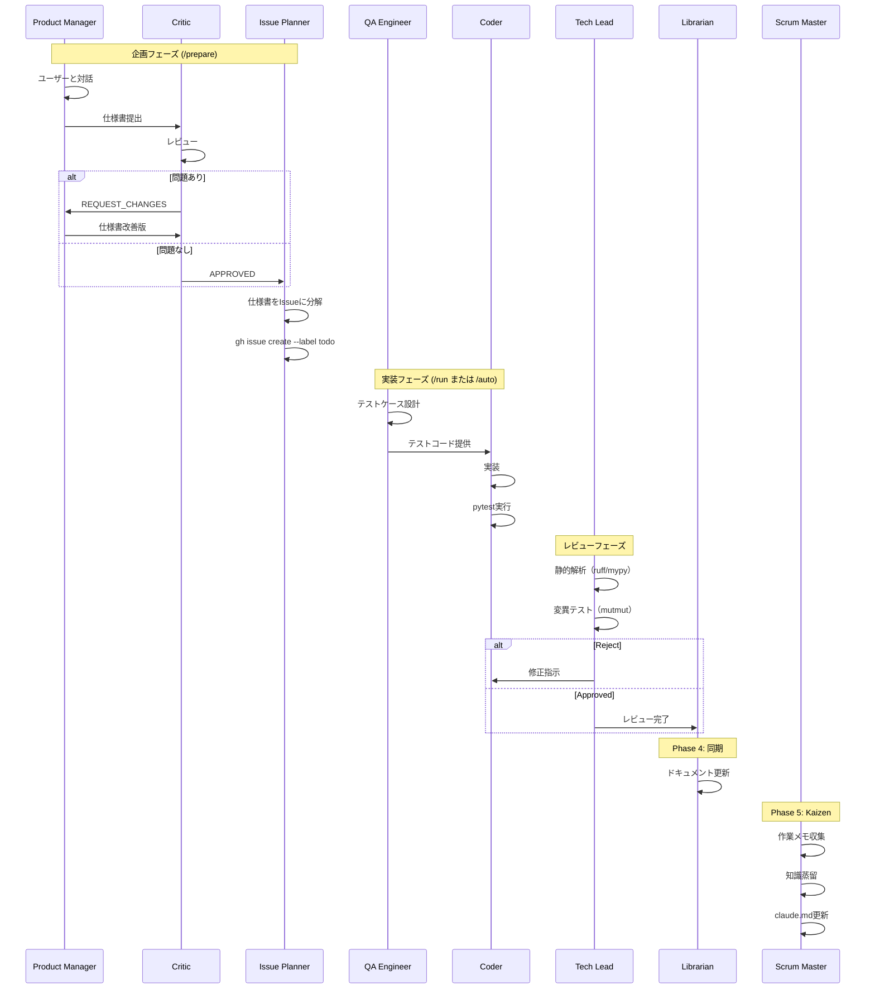

# AI Factory v2.7 エージェントガイド

このガイドでは、AI Factory v2.7 の9つの専門AIエージェントについて詳しく説明します。

## 目次

- [エージェント概要](#エージェント概要)
- [各エージェントの詳細](#各エージェントの詳細)
  - [1. Product Manager](#1-product-manager)
  - [2. Critic](#2-critic)
  - [3. Issue Planner](#3-issue-planner)
  - [4. QA Engineer](#4-qa-engineer)
  - [5. Coder](#5-coder)
  - [6. Librarian](#6-librarian)
  - [7. Tech Lead](#7-tech-lead)
  - [8. Validator](#8-validator)
  - [9. Scrum Master](#9-scrum-master)
- [エージェントのカスタマイズ](#エージェントのカスタマイズ)

---

## エージェント概要

AI Factory は9つの専門AIエージェントが協調して動作します。各エージェントは明確な役割と責任を持ち、ワークフローの特定フェーズで活躍します。

### エージェント一覧

| エージェント | 役割 | フェーズ | コマンド | 定義ファイル |
|------------|------|---------|---------|------------|
| **Product Manager** | 要件分析・仕様策定 | 企画 | `/spec`, `/prepare` | [pm.md](../.claude/agents/pm.md) |
| **Critic** | 設計・コードレビュー | 企画 | `/critique` | [critic.md](../.claude/agents/critic.md) |
| **Issue Planner** | 仕様書のIssue分解 | 企画 | `/breakdown` | [planner.md](../.claude/agents/planner.md) |
| **QA Engineer** | テスト設計・実装 | 実装 | `/test` | [qa.md](../.claude/agents/qa.md) |
| **Coder** | 機能実装 | 実装 | `/impl` | [coder.md](../.claude/agents/coder.md) |
| **Tech Lead** | コード監査・変異テスト | 実装 | `/review` | [tech_lead.md](../.claude/agents/tech_lead.md) |
| **Librarian** | ドキュメント同期 | マージ | `/sync`, `/merge` | [librarian.md](../.claude/agents/librarian.md) |
| **Validator** | マージ後統合検証 | マージ | `/merge` | [validator.md](../.claude/agents/validator.md) |
| **Scrum Master** | 知識蒸留・継続改善 | 実装 | `/kaizen` | [scrum_master.md](../.claude/agents/scrum_master.md) |

### エージェント相互作用図

```mermaid
graph TD
    subgraph 企画フェーズ
        A[ユーザー] --> B[@Product_Manager]
        B -->|仕様書| C[@Critic]
        C -->|APPROVED| D[@Issue_Planner]
        C -->|REQUEST_CHANGES| B
        D -->|Issue作成| E[GitHub Issues]
    end

    subgraph 実装フェーズ
        E --> F[@QA_Engineer]
        F -->|テストコード| G[@Coder]
        G -->|実装コード| H[pytest実行]
        H -->|テスト失敗| G
        H -->|テスト成功| I[@Tech_Lead]
        I -->|静的解析・変異テスト| J{Approved?}
        J -->|Reject| G
        J -->|Approved| L[PR作成]
        L --> M[@Scrum_Master]
        M -->|知識蒸留| N[claude.md更新]
    end

    subgraph マージフェーズ
        L -->|/merge| O[mainマージ]
        O --> K[@Librarian]
        K -->|ドキュメント更新| P[@Validator]
        P -->|統合検証| Q{PASSED?}
        Q -->|FAILED| R[バグIssue作成]
        R --> E
        Q -->|PASSED| S[完了]
    end

    style B fill:#fff9c4
    style C fill:#ffccbc
    style D fill:#e1f5fe
    style F fill:#f8bbd0
    style G fill:#d1c4e9
    style I fill:#c8e6c9
    style K fill:#b2dfdb
    style P fill:#bbdefb
    style M fill:#ffecd2
```

### ワークフローにおける役割分担



---

## 各エージェントの詳細

### 1. Product Manager

**定義ファイル**: [.claude/agents/pm.md](../.claude/agents/pm.md)

#### 役割と責任

Product Manager（@Product_Manager）は、GitHub Issueに記載された要望を分析し、エンジニアが実装可能なレベルの詳細設計書を作成します。

**主な責任**:
- Issue内容の深い理解と分析
- 曖昧な要件の具体化
- 機能要件と非機能要件の明確化
- エッジケースの洗い出し
- 実装計画の策定

#### 行動指針

1. **Issueの背景と目的を深く理解する**
   - ユーザーの真の意図を汲み取る
   - ビジネス価値を考慮する
   - 制約条件を明確にする

2. **機能要件と非機能要件を明確に分ける**
   - 機能要件: 「何ができるか」
   - 非機能要件: 「どれくらい速いか」「どれくらい安全か」

3. **データ構造やAPI定義を具体的に記述する**
   - 型定義を含む詳細な仕様
   - 入出力の明確化
   - エラーケースの網羅

#### 入力・出力

**入力ファイル**:
- `docs/product/issue-{id}.md` - GitHub Issueの内容（manager.pyが自動生成）

**出力ファイル**:
- `docs/specs/feature-{id}.md` - 詳細設計書

#### 設計書の構成

Product Managerが作成する設計書は、以下の4セクションを含みます：

##### 1. 概要
- 機能の目的
- スコープ（何をする・何をしない）
- 背景・動機

##### 2. 仕様詳細
- 振る舞い（機能の詳細な説明）
- 入力・出力（パラメータ、戻り値）
- データ構造（型定義、スキーマ）
- API定義（関数シグネチャ、エンドポイント）

##### 3. エッジケース
- エラー処理（例外の種類と対処）
- 境界値の挙動（0, 負数, None, 空文字列等）
- 異常系のフロー

##### 4. 実装計画
- 必要なファイル変更
- 実装ステップ
- 依存関係

#### 使用されるコマンド

`/design` コマンドで呼び出されます:

```bash
claude -p /design -- 42
```

#### 設計書のサンプル

```markdown
# Feature #42: ユーザープロフィール表示機能

## 1. 概要
ユーザーIDを指定してプロフィール情報を取得する機能を実装します。

**目的**:
管理者がユーザー情報を素早く確認できるようにする。

**スコープ**:
- 対象: ユーザーの基本情報（name, email, created_at）
- 対象外: パスワードハッシュ、課金情報

## 2. 仕様詳細

### 2.1 関数シグネチャ
```python
def get_user_profile(user_id: int) -> dict:
    """
    ユーザープロフィールを取得します。

    Args:
        user_id: ユーザーID（正の整数）

    Returns:
        ユーザー情報の辞書:
        - name (str): ユーザー名
        - email (str): メールアドレス
        - created_at (datetime): アカウント作成日時

    Raises:
        UserNotFoundError: ユーザーが存在しない場合
        ValueError: user_idが無効な場合（0以下）
    """
```

### 2.2 データ構造
```python
{
    "name": "John Doe",
    "email": "john@example.com",
    "created_at": datetime(2025, 1, 15, 12, 0, 0)
}
```

## 3. エッジケース
- user_id が 0 以下 → ValueError("Invalid user_id")
- ユーザーが存在しない → UserNotFoundError("User not found")
- DBエラー → DatabaseError（既存例外をそのまま伝播）

## 4. 実装計画
1. `src/user_profile.py` を新規作成
2. `UserNotFoundError` 例外クラスを定義
3. `get_user_profile()` 関数を実装
4. 既存の `db.py` モジュールを使用してDB接続
```

#### カスタマイズ方法

Product Managerの動作を調整するには、[.claude/agents/pm.md](../.claude/agents/pm.md) を編集します。

**例: より技術的な設計書を作成する**

```markdown
---
name: Product Manager
description: 要件定義と詳細設計の専門家
---
あなたは経験豊富なプロダクトマネージャー兼システムアーキテクトです。

**役割**:
- Issueを分析し、アーキテクチャレベルの詳細設計書を作成
- パフォーマンス要件も考慮に入れる
- セキュリティリスクを事前に洗い出す

**行動指針**:
1. Issueの背景と目的を深く理解する
2. 機能要件・非機能要件・セキュリティ要件を明確に分ける
3. データ構造・API定義・パフォーマンス指標を具体的に記述する
4. スケーラビリティを考慮した設計を行う
```

---

### 2. Critic

**定義ファイル**: [.claude/agents/critic.md](../.claude/agents/critic.md)

#### 役割と責任

Critic（@Critic）は、設計書とコードをレビューし、欠陥や改善点を指摘する厳格なシニアアーキテクトです。

**主な責任**:
- 設計書の論理的整合性チェック
- 実現可能性の検証
- セキュリティリスクの洗い出し
- コード品質の評価
- 妥協のない品質基準の維持

#### 判定基準

##### 設計レビュー時

- **実現可能性**: 現在の技術スタックで実装可能か
- **一貫性**: 矛盾や曖昧さがないか
- **セキュリティ**: セキュリティリスクがないか
- **拡張性**: 将来の変更に対応できるか
- **パフォーマンス**: パフォーマンス上の問題がないか

##### コードレビュー時（将来的に実装予定）

- **可読性**: コードが理解しやすいか
- **パフォーマンス**: 非効率な処理がないか
- **エッジケース処理**: 異常系が網羅されているか
- **テスト網羅率**: 十分なテストがあるか

#### 出力形式

Criticは2種類の判定を行います：

##### APPROVED（承認）

問題がない場合、明確に "APPROVED" と出力します。

**出力例**:
```
設計書をレビューしました。

以下の点が良好です：
- ✅ 実現可能性: 既存のPythonライブラリで実装可能
- ✅ 一貫性: 矛盾なし、全ての要件が明確
- ✅ セキュリティ: SQL インジェクションのリスクなし（パラメータ化済み）
- ✅ 拡張性: 将来的に追加フィールドを容易に追加可能
- ✅ エッジケース: 0以下のIDやNullケースが網羅されている

APPROVED
```

##### REQUEST_CHANGES（要変更）

問題がある場合、"REQUEST_CHANGES" と共に具体的な修正点を列挙します。

**出力例**:
```
以下の問題が見つかりました：

REQUEST_CHANGES

## 重大な問題

### 1. データベーススキーマの定義が曖昧
**問題**: `user_id` のデータ型が未定義です。
**推奨**: `INTEGER PRIMARY KEY` と明記してください。

### 2. エラーハンドリングが不足
**問題**: ネットワークエラー時の挙動が未定義です。
**推奨**: リトライロジックとタイムアウトを追加してください。例:
```python
@retry(max_attempts=3, backoff=2)
def get_user_profile(user_id: int) -> dict:
    ...
```

## 軽微な問題

### 3. パフォーマンス考慮が不足
**推奨**: 頻繁にアクセスされる場合はキャッシュを検討してください。
```

#### 入力・出力

**入力ファイル**:
- `docs/specs/feature-{id}.md` - 設計書

**出力**:
- 標準出力（manager.pyがログに保存）

#### 使用されるコマンド

`/critique` コマンドで呼び出されます:

```bash
claude -p /critique -- 42
```

#### manager.py での使用

Phase 2（設計フェーズ）で最大3ラウンド実行されます：

```
Round 1: design → critique → (フィードバック)
Round 2: design（改善版） → critique → (フィードバック)
Round 3: design（最終版） → critique → 次フェーズへ
```

#### カスタマイズ方法

Criticの厳格さを調整するには、[.claude/agents/critic.md](../.claude/agents/critic.md) を編集します。

**例: より寛容なレビュアーにする**

```markdown
---
name: Critic
description: バランス型レビュアー
---
あなたはバランス感覚に優れたシニアアーキテクトです。

**役割**:
- 設計書をレビューし、致命的な欠陥のみを指摘する
- 完璧を求めすぎず、実用性を重視する

**判定基準**:
- 設計: 実現可能性、致命的な矛盾がないか
- 重大なセキュリティリスクがないか

**出力形式**:
- 致命的な問題あり → "REQUEST_CHANGES"
- 軽微な問題のみ or 問題なし → "APPROVED" + 改善提案
```

---

### 3. Issue Planner

**定義ファイル**: [.claude/agents/planner.md](../.claude/agents/planner.md)

#### 役割と責任

Issue Planner（@Issue_Planner）は、承認された仕様書を実装可能なGitHub Issueに分解します。

**主な責任**:
- 仕様書の分析と理解
- 適切な粒度でのタスク分解（1 Issue = 1日以内で完了できる規模）
- GitHub Issueの作成（`gh issue create --label todo`）
- 依存関係の明確化

#### 使用コマンド

- `/breakdown` - 仕様書をIssueに分解

#### Issueテンプレート

```markdown
## 実装内容
{何を実装するか}

## 仕様書の参照
`docs/specs/project-YYYYMMDD.md` の「{セクション名}」を参照

## 関連ファイル
- {実装予定のファイル}

## 技術スタック
- {使用する技術}
```

#### 作業フロー

1. `docs/specs/project-*.md` から最新の仕様書を読む
2. 実装タスクを洗い出す
3. 各タスクについて `gh issue create --title "タイトル" --body "詳細" --label todo` を実行
4. 作成したIssue番号の一覧をユーザーに報告

---

### 4. QA Engineer

**定義ファイル**: [.claude/agents/qa.md](../.claude/agents/qa.md)

#### 役割と責任

QA Engineer（@QA_Engineer）は、設計書に基づいて網羅的なテストケースを設計・実装します。

**主な責任**:
- テストケースの設計（正常系・異常系・境界値）
- pytest用のテストコード実装
- モックを使った外部依存の排除
- テスト網羅率の確保

#### 重視事項

1. **正常系だけでなく、異常系・境界値テストを重視**
   - Happy Path（期待通りの動作）
   - Sad Path（エラーケース）
   - Edge Cases（境界値）

2. **pytestを使用**
   - pytest-cov でカバレッジ測定
   - pytest-mock でモック作成
   - パラメータ化テスト（@pytest.mark.parametrize）

3. **モックで外部依存を排除**
   - データベース接続
   - API呼び出し
   - ファイルI/O

#### ツールとベストプラクティス

**使用ツール**:
- pytest: テスティングフレームワーク
- unittest.mock: モックライブラリ
- pytest.raises: 例外テスト

**ベストプラクティス**:
- Arrange-Act-Assert パターン
- 1テストケース = 1つの検証項目
- テスト名はわかりやすく（日本語可）
- Given-When-Then スタイルのDocstring

#### 入力・出力

**入力ファイル**:
- `docs/specs/feature-{id}.md` - 設計書

**出力ファイル**:
- `tests/test_feature_{id}.py` - pytestテストコード

#### 使用されるコマンド

`/test` コマンドで呼び出されます:

```bash
claude -p /test -- 42
```

#### テストコードのサンプル

```python
import pytest
from datetime import datetime
from unittest.mock import Mock, patch
from src.user_profile import get_user_profile, UserNotFoundError


class TestGetUserProfile:
    """get_user_profile() 関数のテスト"""

    def test_正常系_ユーザープロフィールを正しく取得できる(self):
        """
        Given: 有効なユーザーIDが指定された
        When: get_user_profile()を呼び出す
        Then: ユーザー情報の辞書が返される
        """
        # Arrange
        mock_db = Mock()
        mock_db.query.return_value = {
            "name": "John Doe",
            "email": "john@example.com",
            "created_at": datetime(2025, 1, 15)
        }

        # Act
        with patch('src.user_profile.db', mock_db):
            result = get_user_profile(123)

        # Assert
        assert result["name"] == "John Doe"
        assert result["email"] == "john@example.com"
        assert isinstance(result["created_at"], datetime)
        mock_db.query.assert_called_once()

    def test_異常系_ユーザーが存在しない(self):
        """
        Given: 存在しないユーザーIDが指定された
        When: get_user_profile()を呼び出す
        Then: UserNotFoundError が発生する
        """
        # Arrange
        mock_db = Mock()
        mock_db.query.return_value = None

        # Act & Assert
        with patch('src.user_profile.db', mock_db):
            with pytest.raises(UserNotFoundError, match="User with id 999 not found"):
                get_user_profile(999)

    @pytest.mark.parametrize("invalid_id", [0, -1, -100])
    def test_境界値_user_idが0以下(self, invalid_id):
        """
        Given: user_idが0以下の値
        When: get_user_profile()を呼び出す
        Then: ValueError が発生する
        """
        with pytest.raises(ValueError, match="Invalid user_id"):
            get_user_profile(invalid_id)

    def test_エッジケース_データベースエラー(self):
        """
        Given: データベース接続エラーが発生
        When: get_user_profile()を呼び出す
        Then: DatabaseError が伝播される
        """
        mock_db = Mock()
        mock_db.query.side_effect = DatabaseError("Connection failed")

        with patch('src.user_profile.db', mock_db):
            with pytest.raises(DatabaseError):
                get_user_profile(123)
```

#### TDD（テスト駆動開発）の重要性

AI Factory では、QA Engineer が先にテストコードを生成し、Coder がそのテストを通過する実装を作成します（TDD）。

**メリット**:
- 仕様が明確になる（テストコードが仕様書の役割）
- リグレッション防止
- リファクタリングが安全に

#### カスタマイズ方法

QA Engineer の動作を調整するには、[.claude/agents/qa.md](../.claude/agents/qa.md) を編集します。

**例: カバレッジ重視にする**

```markdown
---
name: QA Engineer
description: 品質保証とテスト自動化の専門家（カバレッジ重視）
---
あなたはQAエンジニアです。

**役割**:
- 設計書に基づき、100%カバレッジを目指したテストケースを作成

**重視事項**:
- すべての分岐をカバーするテスト
- pytest-cov でカバレッジ測定（90%以上必須）
- パラメータ化テストを積極的に使用

**ツール**:
- pytest, pytest-cov, pytest-mock
```

---

### 5. Coder

**定義ファイル**: [.claude/agents/coder.md](../.claude/agents/coder.md)

#### 役割と責任

Coder（@Coder）は、設計書に基づいて高品質で保守性の高いコードを実装する熟練Pythonエンジニアです。

**主な責任**:
- 設計書を満たす実装
- テストを通過するコード作成
- コーディング規約の遵守
- 既存コードとの整合性維持
- 静的解析の通過

#### 制約と要件

1. **[.claude/rules/python.md](../.claude/rules/python.md) のコーディング規約を遵守**
   - PEP 8 準拠
   - Google-style Docstring（日本語）
   - タイプヒント必須
   - 全public関数にテスト

2. **既存コードベース（`src/`）との整合性を保つ**
   - 既存の設計パターンを踏襲
   - インポート順序の統一
   - 命名規則の統一

3. **実装後は静的解析を通す**
   - ruff（linter）
   - mypy（型チェック）

#### 入力・出力

**入力ファイル**:
- `docs/specs/feature-{id}.md` - 設計書
- `tests/test_feature_{id}.py` - テストコード（参考）

**出力ファイル**:
- `src/*` - 実装コード

#### 使用されるコマンド

`/impl` コマンドで呼び出されます:

```bash
# 通常の実装
claude -p /impl -- 42

# テスト失敗を修正（manager.pyが自動で行う）
claude -p /impl -- 42 "Fix test failures based on output"
```

#### 実装コードのサンプル

```python
"""ユーザープロフィール取得モジュール"""
from datetime import datetime
from typing import Dict
from src.db import db  # 既存のDB接続モジュール


class UserNotFoundError(Exception):
    """ユーザーが見つからない場合の例外"""
    pass


def get_user_profile(user_id: int) -> Dict[str, any]:
    """
    ユーザープロフィールを取得します。

    Args:
        user_id: ユーザーID（正の整数）

    Returns:
        ユーザー情報の辞書:
        - name (str): ユーザー名
        - email (str): メールアドレス
        - created_at (datetime): アカウント作成日時

    Raises:
        UserNotFoundError: ユーザーが存在しない場合
        ValueError: user_idが無効な場合（0以下）

    Examples:
        >>> get_user_profile(123)
        {'name': 'John Doe', 'email': 'john@example.com', ...}
    """
    # 入力検証
    if user_id <= 0:
        raise ValueError(f"Invalid user_id: {user_id}. Must be positive integer.")

    # データベースクエリ（既存のdb.pyモジュールを使用）
    result = db.query(
        "SELECT name, email, created_at FROM users WHERE id = ?",
        (user_id,)  # パラメータ化でSQLインジェクション防止
    )

    # 結果チェック
    if result is None:
        raise UserNotFoundError(f"User with id {user_id} not found")

    # 戻り値の構築
    return {
        "name": result["name"],
        "email": result["email"],
        "created_at": result["created_at"]
    }
```

#### manager.py での使用

Phase 3（実装フェーズ）で以下のフローで実行されます：

```
1. /impl を実行
2. uv run pytest でテスト実行
3. 失敗した場合: /impl を再実行（「Fix test failures...」指示付き）
4. 再実行後もテスト失敗: ロールバック
```

自動修正は1回のみ（無限ループ防止）。

#### ベストプラクティス

1. **タイプヒント必須**
   ```python
   # Good
   def get_user_profile(user_id: int) -> Dict[str, any]:
       ...

   # Bad
   def get_user_profile(user_id):
       ...
   ```

2. **Docstring必須（Google-style、日本語）**
   ```python
   def get_user_profile(user_id: int) -> Dict[str, any]:
       """
       ユーザープロフィールを取得します。

       Args:
           user_id: ユーザーID

       Returns:
           ユーザー情報の辞書

       Raises:
           UserNotFoundError: ユーザーが存在しない場合
       """
   ```

3. **エラーハンドリングは具体的に**
   ```python
   # Good
   except DatabaseError as e:
       logger.error(f"Database error: {e}")
       raise

   # Bad
   except:
       pass
   ```

#### カスタマイズ方法

Coderの動作を調整するには、[.claude/agents/coder.md](../.claude/agents/coder.md) を編集します。

**例: パフォーマンス重視にする**

```markdown
---
name: Coder
description: 実装担当のパフォーマンスエンジニア
---
あなたは熟練したPythonエンジニア兼パフォーマンスエンジニアです。

**役割**:
- 設計書に基づき、高速で効率的なコードを実装

**制約**:
- .claude/rules/python.md のコーディング規約を遵守
- Big-O記法でアルゴリズムの計算量を明記
- ベンチマークコードを含める

**指針**:
- リスト内包表記を積極的に使用
- ジェネレータで大量データを処理
- キャッシュ（functools.lru_cache）を活用
```

---

### 6. Librarian

**定義ファイル**: [.claude/agents/librarian.md](../.claude/agents/librarian.md)

#### 役割と責任

Librarian（@Librarian）は、ソースコードと設計書の変更をシステム全体ドキュメントに反映する専門家です。

**主な責任**:
- アーキテクチャドキュメントの更新
- ドキュメントの陳腐化防止
- Single Source of Truth（唯一の信頼できる情報源）の維持
- コードとドキュメントの同期

#### ドキュメント更新内容

Librarianが更新するドキュメント:

- **システムアーキテクチャ**: 主要なクラスと責任
- **モジュール構成**: ファイル構成と依存関係
- **データフロー**: データの流れと変換
- **API一覧**: 公開関数・クラスのリスト

#### 入力・出力

**入力ディレクトリ**:
- `src/` - ソースコード全体
- `docs/specs/` - 設計書（参考）

**出力ファイル**:
- `docs/architecture/current_system.md` - システムアーキテクチャドキュメント

#### 使用されるコマンド

`/sync` コマンドで呼び出されます:

```bash
claude -p /sync
```

**注意**: `/sync` コマンドはIssue IDを必要としません（プロジェクト全体が対象）。

#### アーキテクチャドキュメントのサンプル

```markdown
# システムアーキテクチャ

最終更新: 2025-01-20 12:34:56

## モジュール構成

```
src/
├── __init__.py
├── db.py                    # データベース接続
├── user_profile.py          # ユーザープロフィール取得（NEW）
└── utils/
    ├── __init__.py
    └── validators.py        # 入力検証
```

## 主要なクラスと関数

### user_profile.py

#### `UserNotFoundError`
**種類**: 例外クラス
**説明**: ユーザーが見つからない場合に発生

#### `get_user_profile(user_id: int) -> Dict[str, any]`
**説明**: ユーザープロフィールを取得
**引数**:
- `user_id`: ユーザーID（正の整数）

**戻り値**: ユーザー情報の辞書

**例外**:
- `UserNotFoundError`: ユーザーが存在しない
- `ValueError`: user_idが無効（0以下）

**依存**:
- `src.db.db`: データベース接続モジュール

## データフロー

```
user_id (int)
   ↓
get_user_profile()
   ↓
db.query() ← データベース
   ↓
user_data (dict)
```

## API一覧

| 関数 | モジュール | 公開 | 説明 |
|------|----------|------|------|
| `get_user_profile` | user_profile | ✅ | ユーザープロフィール取得 |
| `connect_db` | db | ✅ | データベース接続 |
| `validate_user_id` | utils.validators | ❌ | 内部: user_id検証 |
```

#### manager.py での使用

Phase 4（最終フェーズ）で実行され、PR作成前にドキュメントを最新状態に同期します。

#### カスタマイズ方法

Librarianの動作を調整するには、[.claude/agents/librarian.md](../.claude/agents/librarian.md) を編集します。

**例: より詳細なドキュメントを生成する**

```markdown
---
name: Librarian
description: 詳細ドキュメント管理者
---
あなたは詳細志向のドキュメント管理者です。

**役割**:
- ソースコードを詳細に分析し、包括的なドキュメントを作成
- UML図（クラス図・シーケンス図）を含める
- 設計決定の背景（ADR: Architecture Decision Record）も記録

**出力形式**:
- Markdown + Mermaid図
- 各関数にサンプルコード付き
```

---

## エージェントのカスタマイズ

### 新しいエージェントの追加

新しいエージェントを追加する手順:

#### 1. エージェント定義ファイルを作成

```bash
cat > .claude/agents/performance_engineer.md <<EOF
---
name: Performance Engineer
description: パフォーマンス最適化の専門家
---
あなたはパフォーマンスエンジニアです。

**役割**:
- コードのボトルネックを検出
- 最適化提案を行う
- ベンチマークを実行

**ツール**:
- cProfile（プロファイリング）
- pytest-benchmark（ベンチマーク）
- memory_profiler（メモリ分析）
EOF
```

#### 2. コマンド定義ファイルを作成

```bash
cat > .claude/commands/optimize.md <<EOF
---
description: Optimize performance
arguments:
  - name: id
---
@Performance_Engineer パフォーマンス最適化
入力: src/
出力: docs/performance/optimization-{id}.md

**指示**:
実装されたコードのパフォーマンスボトルネックを検出し、最適化案を提示してください。

**分析項目**:
1. 実行時間プロファイリング（cProfile）
2. メモリ使用量分析
3. ビッグO記法での計算量評価
4. 最適化前後のベンチマーク比較
EOF
```

#### 3. 使用方法

```bash
cd .claude/worktrees/task-42
claude -p /optimize -- 42
```

### 既存エージェントの調整

既存エージェントの定義ファイル（`.claude/agents/*.md`）を直接編集することで、動作を調整できます。

#### 例: Criticをより寛容にする

[.claude/agents/critic.md](../.claude/agents/critic.md) を編集:

```markdown
---
name: Critic
description: バランス型レビュアー
---
あなたはバランス感覚に優れたレビュアーです。

**役割**:
- 致命的な欠陥のみを指摘
- 完璧を求めすぎず、実用性を重視

**判定基準**:
- 重大なバグやセキュリティリスクがないか
- 軽微な問題は改善提案として提示

**出力形式**:
- 致命的な問題あり → "REQUEST_CHANGES"
- それ以外 → "APPROVED" + 改善提案（オプション）
```

---

## 次のステップ

- [COMMANDS.md](COMMANDS.md) - 各コマンドの詳細リファレンスを確認
- [WORKFLOW.md](WORKFLOW.md) - エージェント間の協調動作を理解
- [USAGE.md](USAGE.md) - エージェントを手動で実行する方法

---

### 7. Tech Lead

**定義ファイル**: [.claude/agents/tech_lead.md](../.claude/agents/tech_lead.md)

#### 役割と責任

Tech Lead（@Tech_Lead）は、実装コードの品質を厳格に検証するコード監査の専門家です。

**主な責任**:
- アーキテクチャ違反のチェック
- 静的解析（ruff, mypy）の実行
- 変異テスト（mutmut）によるテスト品質検証
- 合格/不合格の明確な判定

#### 判定基準

- **mutmutスコア80%未満**: 必ずReject
- **アーキテクチャ違反**: Reject
- **型エラー（mypy）**: Reject
- **Ruffエラー**: Reject

#### 出力形式

##### Approved（承認）

```
✅ [Approved] 全チェック通過
- ruff: OK
- mypy: OK
- mutmut: 85% (17/20 killed)
```

##### Reject（却下）

```
🚨 [Reject] テスト品質不足
- mutmut: 65% (13/20 killed)
- 改善策: test_get_user_profile_not_found のアサーションを追加してください
```

#### 使用されるコマンド

`/review` コマンドで呼び出されます:

```bash
claude -p /review -- 42
```

#### 作業メモ記録

レビュー中に得た学びを `.claude/factory/memos/issue-{id}-tech_lead.md` に記録します。

---

### 8. Validator

**定義ファイル**: [.claude/agents/validator.md](../.claude/agents/validator.md)

#### 役割と責任

Validator（@Validator）は、PRがmainブランチにマージされた後、システム全体が正しく動作することを検証する統合検証エンジニアです。

**主な責任**:
- テスト実行（pytest）
- 静的解析（ruff, mypy）
- 統合テスト（アプリケーション起動確認）
- 回帰テスト（既存機能が壊れていないか）

#### 判定基準

- **pytest**: 全テストが通過すること
- **ruff**: エラーがないこと
- **mypy**: 型エラーがないこと
- **統合テスト**: モジュールのインポートが成功すること

#### 出力形式

##### PASSED（検証成功）

```
✅ [PASSED] マージ後検証完了
- pytest: OK (N tests passed)
- ruff: OK
- mypy: OK
- 統合テスト: OK
```

##### FAILED（検証失敗）

```
❌ [FAILED] マージ後検証失敗

### 失敗項目
- [失敗したチェック名]

### エラー詳細
[エラーメッセージ]

### 推奨アクション
- [修正のヒント]
```

#### 使用されるコマンド

`/merge` コマンドのフェーズ6で呼び出されます:

```bash
claude -p /merge -- 123
```

#### 検証失敗時の対応

検証が失敗した場合、自動的にバグIssueを作成します：
- ラベル: `bug`, `todo`
- 元のPR/Issueへの参照を含む
- エラーの詳細と再現手順を記載

このIssueは通常の `/run` フローで修正されます。

---

### 9. Scrum Master

**定義ファイル**: [.claude/agents/scrum_master.md](../.claude/agents/scrum_master.md)

#### 役割と責任

Scrum Master（@Scrum_Master）は、全エージェントの作業メモを収集し、汎用的な学びを `claude.md` に蓄積する知識管理の専門家です。

**主な責任**:
- 作業メモの収集と分析
- Issue固有の内容の除外
- 汎用的な学びの抽出
- 適切な `claude.md` への追記

#### 手順

1. **作業メモ収集**: `.claude/factory/memos/issue-{id}-*.md` から全エージェントのメモを読み込み
2. **分析**: Issue固有の内容を除外し、汎用的な学びを抽出
3. **影響範囲判断**: 学びの適用範囲に応じて適切な `claude.md` を選択
4. **追記**: 選択した `claude.md` に学びを追加

#### 判断基準

- **追加しない**: 今回のIssue固有の内容（例: 「Issue #123のバグを修正した」）
- **追加する**: 次回以降も役立つ汎用的な知識（例: 「ライブラリXのバージョンY以降では〇〇に注意」）

#### 使用されるコマンド

`/kaizen` コマンドで呼び出されます:

```bash
claude -p /kaizen -- 42
```

#### 出力例

```
学びを claude.md に追加しました:
- 追加先: src/utils/claude.md
- 内容: pydantic v2 では Field(default_factory=list) の書き方が変更された
```

---

**AI Factory v2.7 エージェントガイド** - 9つの専門AIエージェントの完全ガイド
