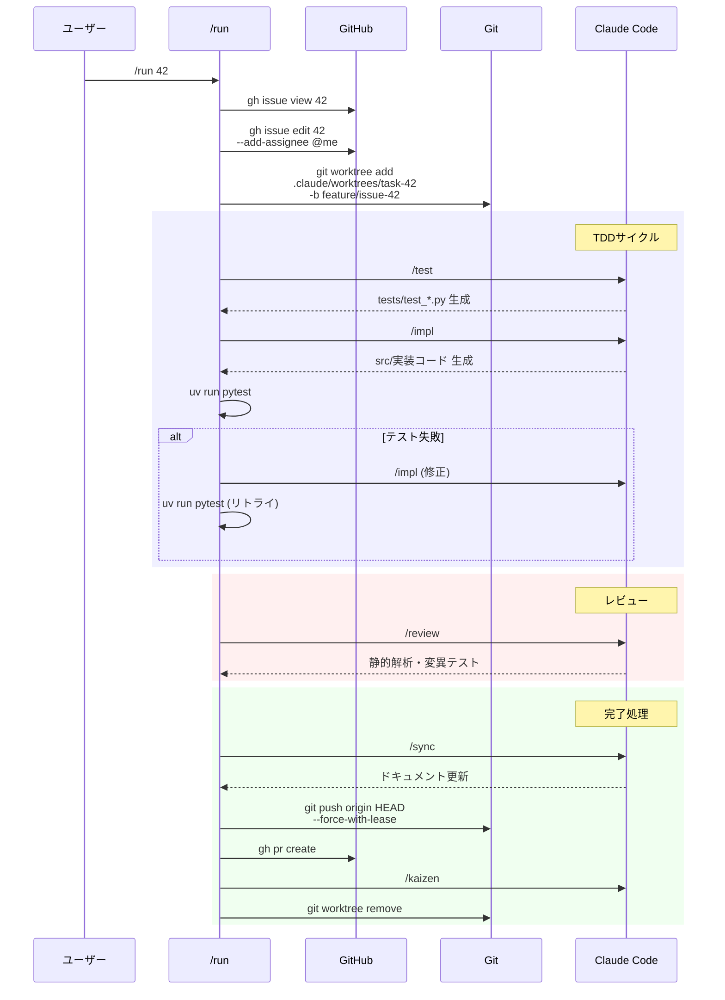

# AI Factory v2.6 ワークフロー詳細

このガイドでは、AI Factory v2.6 の内部動作を技術的に詳細に説明します。

## 目次

- [全体アーキテクチャ](#全体アーキテクチャ)
- [推奨ワークフロー](#推奨ワークフロー)
- [企画フェーズ（/prepare）](#企画フェーズprepare)
- [実装フェーズ（/run, /auto）](#実装フェーズrun-auto)
- [エラーハンドリング](#エラーハンドリング)
- [設定とカスタマイズ](#設定とカスタマイズ)
- [レガシー: ポーリング方式](#レガシー-ポーリング方式)

---

## 全体アーキテクチャ

### システム構成図

```mermaid
graph TB
    subgraph "ユーザー操作"
        U[ユーザー]
        PLAN[/prepare]
        AUTO[/auto]
        RUN[/run]
    end

    subgraph "企画フェーズ"
        SPEC[/spec]
        CRITIQUE[/critique]
        BREAKDOWN[/breakdown]
        GI[GitHub Issues<br/>label: todo]
    end

    subgraph "実装フェーズ"
        WT[Git Worktree]
        TEST[/test]
        IMPL[/impl]
        REVIEW[/review]
        SYNC[/sync]
        PR[PR作成]
        KAIZEN[/kaizen]
    end

    subgraph "8つのエージェント"
        PM[@Product_Manager]
        CR[@Critic]
        IP[@Issue_Planner]
        QA[@QA_Engineer]
        CD[@Coder]
        TL[@Tech_Lead]
        LB[@Librarian]
        SM[@Scrum_Master]
    end

    U --> PLAN
    PLAN --> SPEC --> PM
    PM --> CRITIQUE --> CR
    CR -->|APPROVED| BREAKDOWN --> IP
    CR -->|REQUEST_CHANGES| SPEC
    IP --> GI

    U --> AUTO
    U --> RUN
    AUTO --> RUN
    GI --> RUN
    RUN --> WT
    WT --> TEST --> QA
    QA --> IMPL --> CD
    CD --> REVIEW --> TL
    TL -->|Approved| SYNC --> LB
    TL -->|Reject| IMPL
    LB --> PR
    PR --> KAIZEN --> SM
```

### 推奨ワークフロー

```bash
# 1. 企画フェーズ（仕様書作成 → レビュー → Issue分解）
/prepare

# 2. 実装フェーズ（全Issueを自動処理）
/auto

# または、特定のIssueのみ処理
/run 42
```

### データフロー図

```mermaid
flowchart TD
    A[/prepare 実行] --> B[/spec]
    B --> C[docs/specs/<br/>spec.md]
    C --> D[/critique]
    D --> E{レビュー判定}
    E -->|REQUEST_CHANGES| B
    E -->|APPROVED| F[/breakdown]
    F --> G[GitHub Issues<br/>label: todo]

    G --> H[/run 実行]
    H --> I[Git Worktree作成]
    I --> J[/test]
    J --> K[tests/<br/>test_*.py]
    K --> L[/impl]
    L --> M[src/<br/>実装コード]
    M --> N[pytest実行]
    N -->|失敗| L
    N -->|成功| O[/review]
    O --> P[/sync]
    P --> Q[docs/architecture/<br/>current_system.md]
    Q --> R[git push<br/>--force-with-lease]
    R --> S[gh pr create]
    S --> T[GitHub<br/>Pull Request]
    T --> U[/kaizen]

    style A fill:#e1f5ff
    style T fill:#c8e6c9
    style C fill:#fff9c4
    style E fill:#ffccbc
    style K fill:#f8bbd0
    style M fill:#d1c4e9
    style Q fill:#b2dfdb
```

### アーキテクチャの特徴

#### 1. Git Worktree による独立した作業環境

各Issueごとに独立したGit Worktreeを作成し、並行作業をサポートします。

```
.claude/worktrees/
├── task-42/     # Issue #42 専用
│   ├── .git     # worktree専用Git情報
│   ├── docs/
│   ├── src/
│   └── tests/
└── task-43/     # Issue #43 専用（将来の拡張で並行実行可能）
```

**メリット**:
- メインブランチを汚さない
- 複数Issueの並行作業が可能（将来的に）
- 失敗時のクリーンアップが容易

#### 2. 8つの専門AIエージェント

各エージェントが明確な役割を持ち、専門分野に特化します。

| エージェント | 専門分野 | 出力 |
|------------|---------|------|
| Product Manager | 要件分析 | 詳細設計書 |
| Critic | 品質評価 | レビュー結果 |
| Issue Planner | Issue分解 | GitHub Issues |
| QA Engineer | テスト設計 | テストコード |
| Coder | 実装 | 実装コード |
| Tech Lead | コード監査 | 品質判定 |
| Librarian | ドキュメント | アーキテクチャ文書 |
| Scrum Master | 知識管理 | claude.md更新 |

#### 3. フィードバックループ

設計フェーズでは、design ↔ critique のフィードバックループを最大3ラウンド実行し、品質を段階的に向上させます。

```
Round 1: design → critique → (問題あり)
Round 2: design（改善版） → critique → (問題あり)
Round 3: design（最終版） → critique → (合格 or 停滞検出)
```

---

## 企画フェーズ（/prepare）

### 概要

`/prepare` コマンドは、ヒアリング → 仕様書作成 → レビュー → Issue分解を一連の流れで実行します。

### 全体フロー

```
/prepare
│
├─── ヒアリングフェーズ（対話あり）─────────────┐
│    ユーザーと対話して要件を明確化              │
│    要件サマリーの承認を得る                   │
└───────────────────────────────────────────────┘
         ↓ 承認後
┌─── 自動実行フェーズ（確認なし）───────────────┐
│    /spec → /critique → /breakdown            │
│    途中で停止・確認しない                     │
└───────────────────────────────────────────────┘
         ↓
     最終報告
```

### ヒアリングフェーズ（対話あり）

以下の項目が**全て明確になるまで**ユーザーと対話します：

| # | 項目 | 確認すべきこと |
|---|------|---------------|
| 1 | **入力仕様** | 何を受け取るか？データ形式は？ソースは？ |
| 2 | **出力仕様** | 何を生成するか？データ形式は？保存先は？ |
| 3 | **処理ロジック** | 入力→出力の変換ルールは？ |
| 4 | **エラー処理** | 異常時の動作は？ |
| 5 | **スコープ外** | やらないことは何か？ |
| 6 | **成功基準** | 何をもって完了とするか？ |

全項目が明確になったら、**要件サマリー**を提示し、承認を得ます。

### 自動実行フェーズ（確認なし）

承認後は、確認なしで以下を自動実行します。

#### ステップ1: 仕様書作成（/spec）

@Product_Manager エージェントが、プロジェクトの仕様書を作成します。

**出力**: `docs/specs/spec.md`

#### ステップ2: レビュー（/critique）

@Critic エージェントが、仕様書をレビューします。

**判定結果**:
- `APPROVED`: 次のステップへ
- `REQUEST_CHANGES`: 修正が必要（/specを再実行、最大3ラウンド）

#### ステップ3: Issue分解（/breakdown）

@Issue_Planner エージェントが、仕様書をIssueに分解し、GitHub Issueを作成します。

```bash
gh issue create --title "..." --body "..." --label todo
```

### フロー図

```mermaid
flowchart TD
    A[/prepare 開始] --> B[ヒアリング]
    B --> C{要件明確?}
    C -->|No| B
    C -->|Yes| D[要件サマリー提示]
    D --> E{承認?}
    E -->|No| B
    E -->|Yes| F[/spec]
    F --> G[docs/specs/<br/>spec.md 生成]
    G --> H[/critique]
    H --> I{レビュー結果}
    I -->|APPROVED| J[/breakdown]
    I -->|REQUEST_CHANGES| F
    J --> K[GitHub Issues<br/>label: todo]
    K --> L[完了]

    style A fill:#e1f5ff
    style B fill:#fff9c4
    style D fill:#fff9c4
    style L fill:#c8e6c9
    style I fill:#ffccbc
```

---

## 実装フェーズ（/run, /auto）

### 概要

`/run {issue_id}` コマンドは、単一Issueの実装パイプラインを実行します。
`/auto` コマンドは、全ての`label:todo`かつ`no:assignee`のIssueを順次処理します。

### /run コマンドのフロー



### Git Worktreeの作成

各Issueごとに独立したGit Worktreeを作成します。

```bash
git worktree add .claude/worktrees/task-{issue_id} -b feature/issue-{issue_id}
```

**作成されるWorktree**:
```
.claude/worktrees/task-42/
├── .git                    # worktree専用Git情報
├── docs/
│   └── specs/              # 設計書
├── tests/                  # テストコード
└── src/                    # 実装コード
```

### /auto コマンドの動作

```bash
/auto
```

1. `gh issue list --search "label:todo no:assignee state:open sort:created-asc"` で対象Issueを取得
2. 各Issueに対して:
   - 楽観的ロックで割り当て
   - `/run {issue_id}` を実行
3. 全Issue処理完了まで繰り返し

### 楽観的ロック（Optimistic Locking）

複数のClaude Codeインスタンスが同時に実行されている場合、同じIssueを重複処理しないように楽観的ロックを実装しています。

**フロー**:
1. Issueが未割り当てか確認
2. 自分を割り当て（`gh issue edit --add-assignee @me`）
3. 2秒待機
4. 割り当てを再確認
5. 自分のみが割り当てられていれば成功、他のボットも割り当てられていれば失敗（スキップ）

### TDDサイクル

#### テスト生成（/test）

@QA_Engineer エージェントがテストコードを生成します。

```bash
uv run pytest  # 構文エラーがないことを確認（この時点ではテスト失敗OK）
```

#### 実装（/impl）

@Coder エージェントがテストを通過する実装を作成します。

```bash
uv run pytest -v  # テスト実行
```

#### 自動修正（最大3回リトライ）

テスト失敗時は自動的に修正を試みます。

### コードレビュー（/review）

@Tech_Lead エージェントが以下を実行します：

1. 静的解析（ruff, mypy）
2. 変異テスト（mutmut）
3. 問題があればIssueにコメント

### ドキュメント同期（/sync）

@Librarian エージェントがアーキテクチャドキュメントを更新します。

### PR作成

```bash
git push origin HEAD --force-with-lease
gh pr create --title "feat: Resolve #{issue_id}" --body "Closes #{issue_id}"
```

### 知識蒸留（/kaizen）

@Scrum_Master エージェントが作業中の学びを記録します。

- `.claude/factory/memos/issue-{issue_id}-*.md` に詳細を記録
- 汎用的な学びを `claude.md` に追記

### クリーンアップ

```bash
git worktree remove .claude/worktrees/task-{issue_id}
git worktree prune
```

---

## エラーハンドリング

### /run コマンドのエラーハンドリング

各フェーズで失敗した場合、以下の処理が実行されます：

1. Issueにコメントを投稿（失敗理由）
2. `todo` ラベルを削除
3. `failed` ラベルを付与
4. worktreeをクリーンアップ

### ロールバックが発生する条件

| 条件 | 理由 |
|------|------|
| Worktree作成失敗 | "Worktree creation failed" |
| テスト生成失敗 | "Test Generation Failed" |
| 実装失敗（3回リトライ後） | "Implementation Failed" |
| テスト失敗（3回リトライ後） | "Tests failed" |
| 静的解析エラー | "Review Failed" |
| Push失敗 | "Push Failed (Remote has changed)" |

### エラー時のIssue状態

```bash
# エラー時の自動処理
gh issue edit {issue_id} \
  --remove-assignee @me \
  --remove-label todo \
  --add-label failed
```

---

## 設定とカスタマイズ

### 主要パラメータ

| パラメータ | 説明 | デフォルト |
|----------|------|----------|
| 監視ラベル | 処理対象のラベル | `todo` |
| 最大リトライ回数 | 実装失敗時のリトライ | 3回 |
| テストタイムアウト | pytest実行のタイムアウト | 5分 |

### --force-with-lease について

`git push --force-with-lease` は安全なforce pushです。

| オプション | 説明 | リスク |
|----------|------|--------|
| `--force` | 無条件でリモートを上書き | **高**: 他者の変更を破壊する可能性 |
| `--force-with-lease` | リモートが予期した状態の場合のみ上書き | **低**: 他者の変更がある場合は拒否 |

---

## レガシー: ポーリング方式

以前のバージョン（v2.5以前）では、`manager.py` と `worker.sh` によるポーリング方式を採用していました。

### 旧ファイルの場所

```
.claude/factory/legacy/
├── manager.py     # ポーリングベースの自動処理スクリプト
└── worker.sh      # manager.pyの再起動ラッパー
```

### ポーリング方式の動作

旧方式では、`manager.py` が10秒ごとにGitHub Issueをポーリングし、新しいIssueを検知すると自動的に処理を開始していました。

```bash
# 旧方式の起動
cd .claude/factory
nohup bash worker.sh > worker_output.log 2>&1 &
```

### 新方式との比較

| 項目 | 旧方式（ポーリング） | 新方式（コマンド） |
|------|---------------------|-------------------|
| 起動 | バックグラウンドで常駐 | オンデマンド実行 |
| 並列処理 | 自動（複数インスタンス） | 手動（複数ターミナル） |
| デバッグ | ログファイル参照 | リアルタイム出力 |
| リソース | 常時消費 | 実行時のみ |

新方式（`/prepare`, `/run`, `/auto`）は、テストや開発が容易で、より柔軟な運用が可能です。

---

## 次のステップ

- [AGENTS.md](AGENTS.md) - 各フェーズで活躍する8つのエージェントの詳細
- [COMMANDS.md](COMMANDS.md) - 11個のコマンドの完全リファレンス
- [USAGE.md](USAGE.md) - 実際の使用例とトラブルシューティング

---

**AI Factory v2.6 ワークフロー詳細** - 内部動作の完全ガイド
